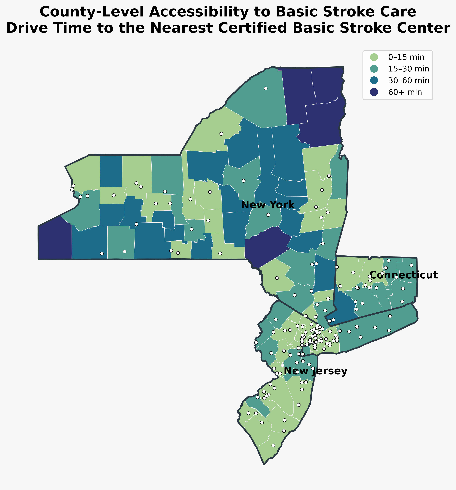
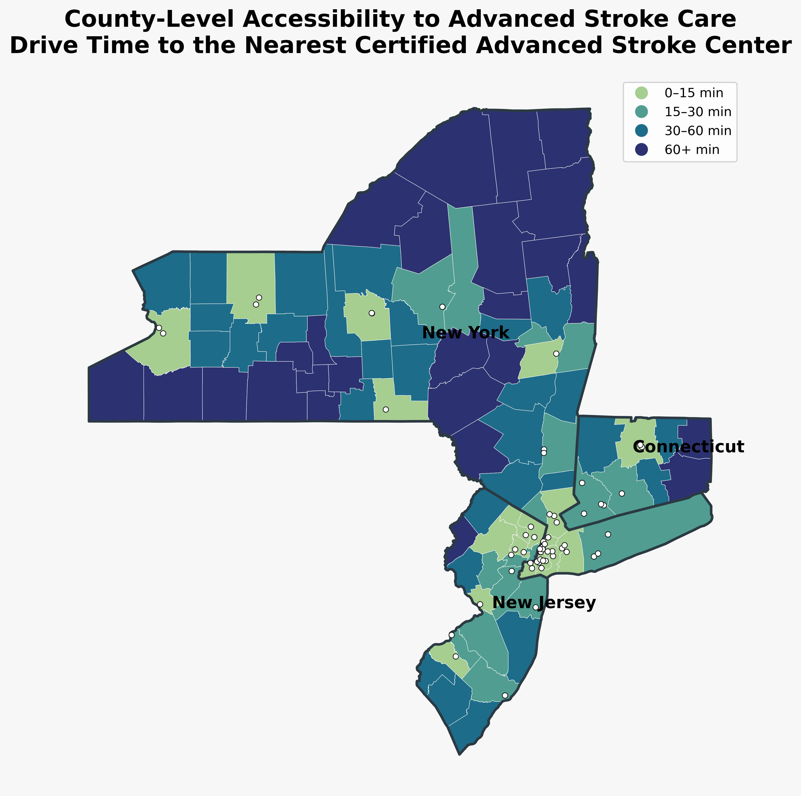
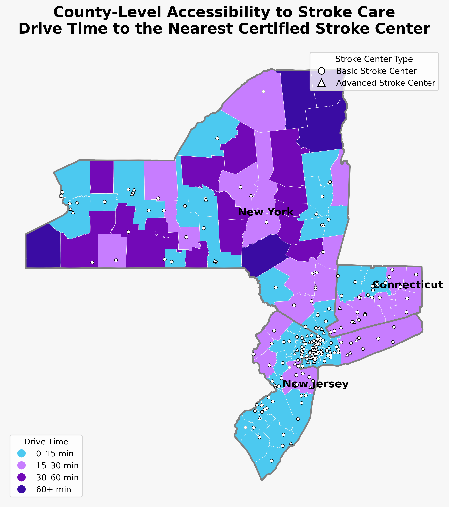
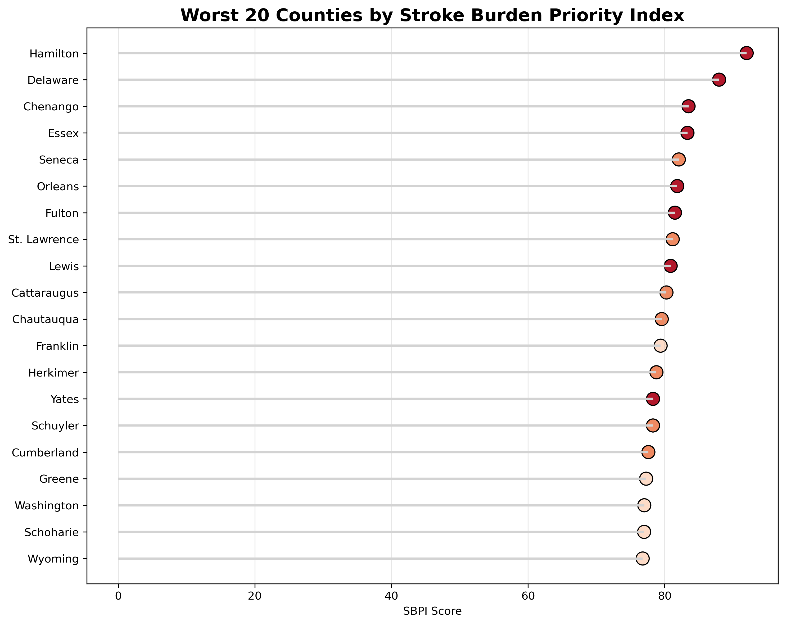
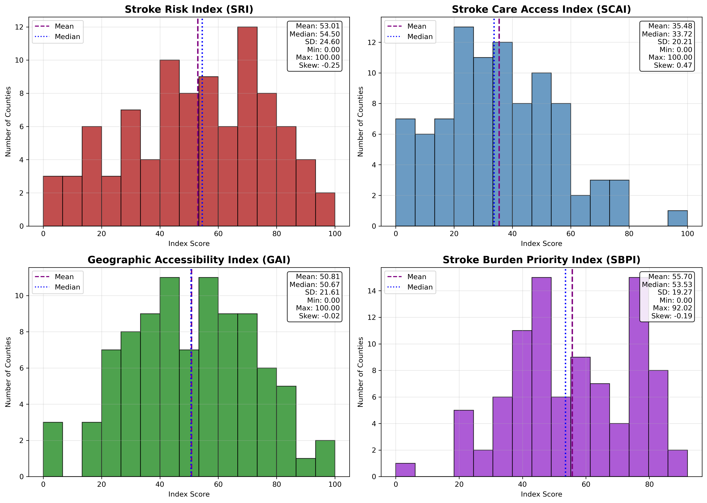
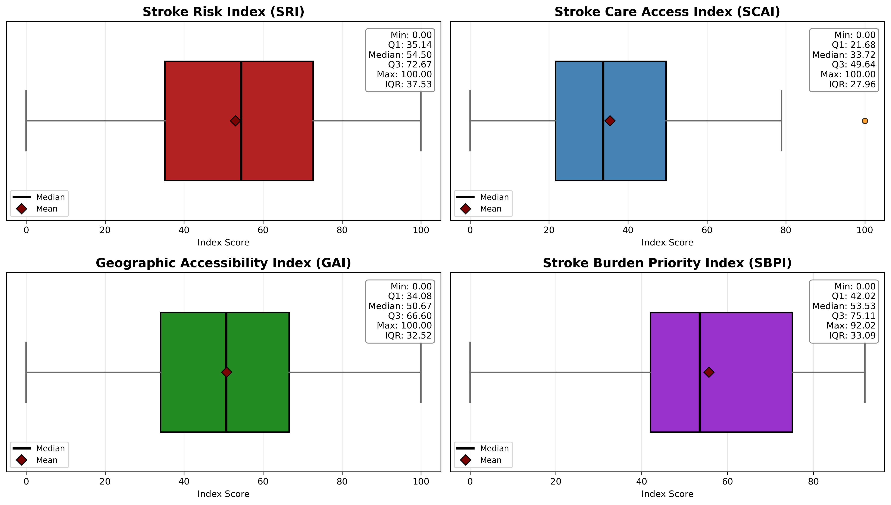
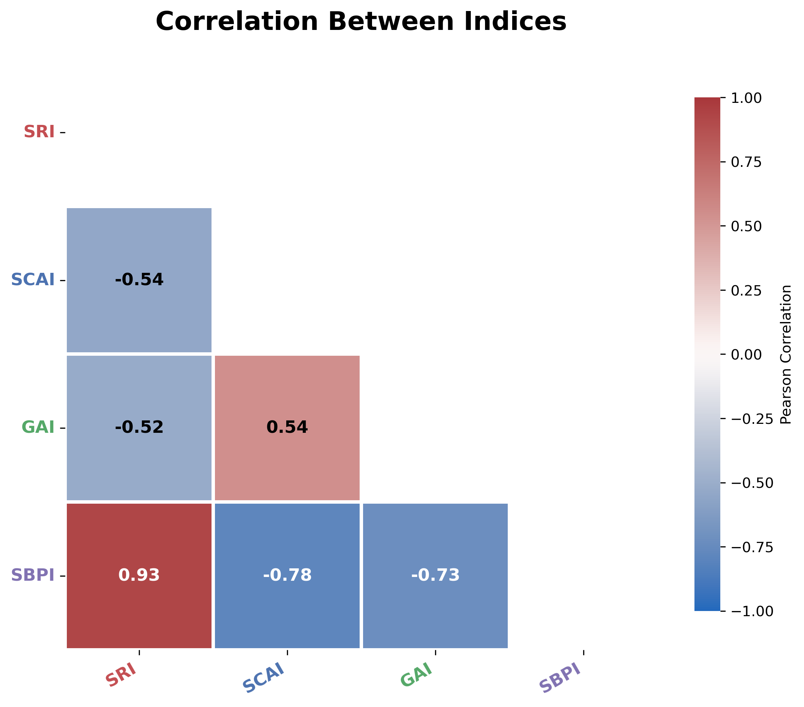
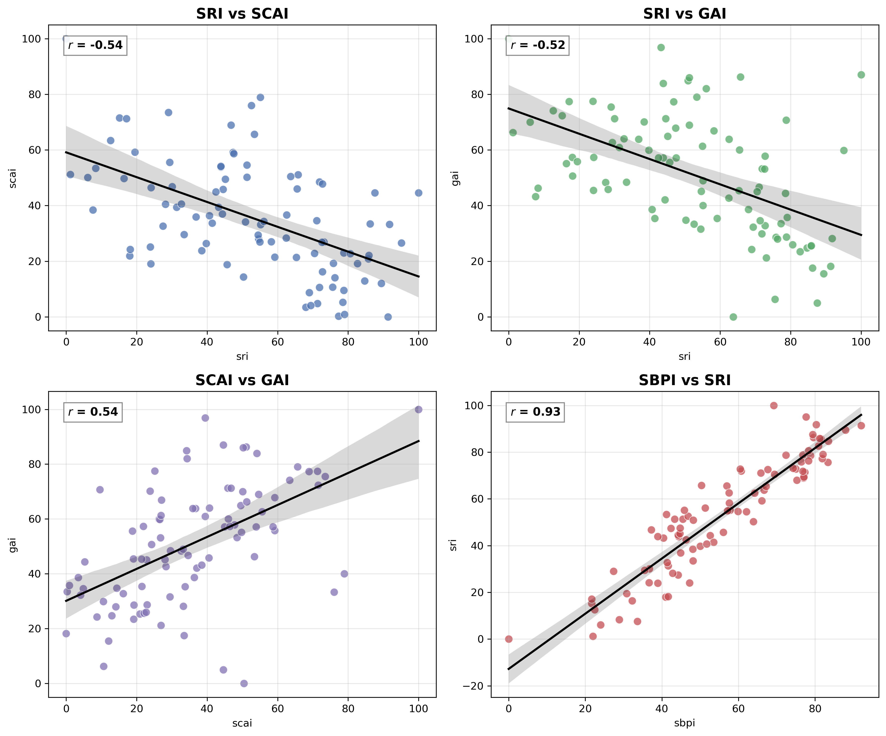
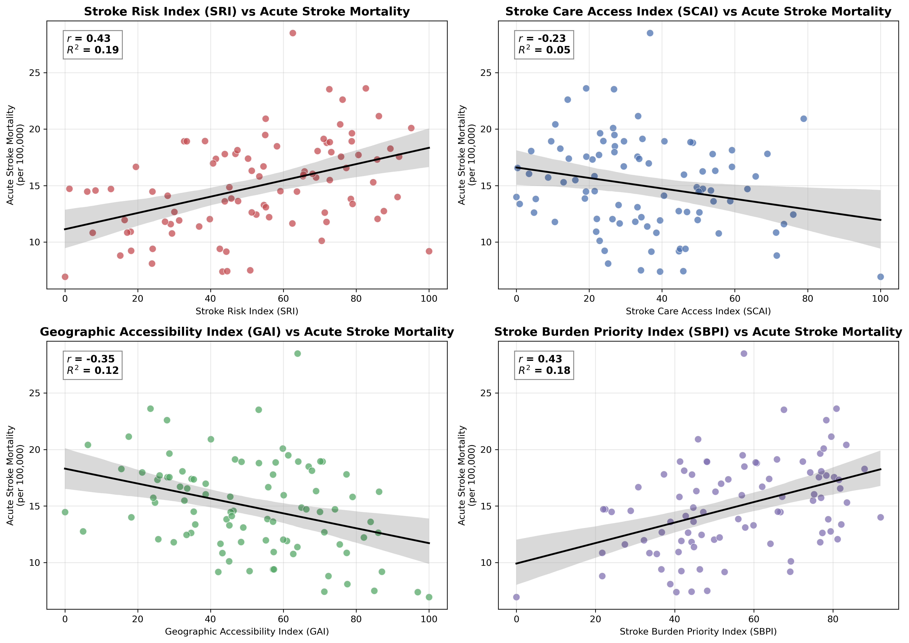
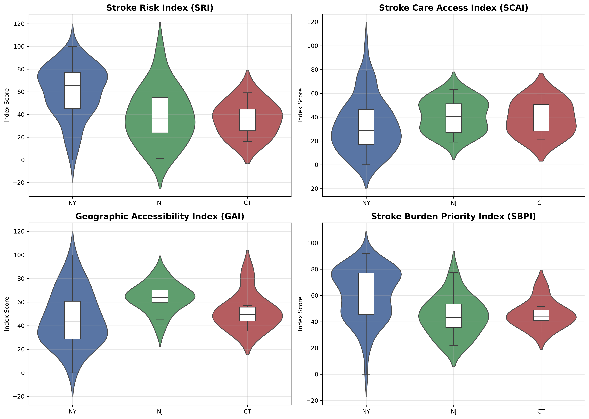

Combining stroke risk with access to care across 91 counties surfaces a clear
pattern: **12 counties are stroke care deserts** — high risk *and* poor access —
and every one of them is rural upstate New York, led by Hamilton County
(risk 91/100, access 0.04/100). Under the combined Stroke Burden Priority
Index, the highest-burden counties are Hamilton, Delaware, and Chenango.

The [interactive dashboard]({{ site.baseurl }}/dashboard/) shows the full
picture — including the Risk vs. Access matrix where these counties cluster in
the critical-intervention quadrant.

*Draft skeleton — this section will grow into the full analysis summary with
figures and plots (Discord 7/7). Drop finished .md content and images
(`docs/images/`) here.*

# Project Outcomes

## Overview

Briefly summarize what the project produced and how the indices can be used.

---

## County-Level Stroke Burden Database (Optional Section ?)

Describe the final integrated database.

Include:

- 91 counties
- NY, NJ, CT
- One record per county
- Variables from all data sources
- Master database used throughout the project

---

## Stroke Risk Index (SRI)

Describe:

- What it measures
- Key findings
- Counties with highest/lowest scores
- Distribution of scores

- Top 10 counties

---

## Stroke Care Access Index (SCAI)

Describe:

- What it measures
- General patterns
- Counties with highest/lowest access
- Interpretation

- Top 10 counties

---

## Geographic Accessibility Index (GAI)

Describe:

- What it measures
- Geographic patterns
- Urban vs rural differences
- Interpretation

Figures: 

<h2>Accessibility to Basic Stroke Centers</h2>

  

<i>Figure 1. County-level drive time to the nearest certified Basic Stroke Center. Counties are categorized into four travel-time intervals, illustrating regional differences in access to basic stroke care.</i>

Basic stroke centers are distributed throughout the region, resulting in relatively short travel times for most counties. The highest accessibility is concentrated around major metropolitan areas, while some rural counties in northern New York remain more than 60 minutes from the nearest facility. Overall, the map suggests that access to basic stroke care is relatively widespread, though notable geographic disparities remain in rural regions.

<h2>Accessibility to Advanced Stroke Centers</h2>

  

<i>Figure 2. County-level drive time to the nearest certified Advanced Stroke Center. Advanced stroke centers are concentrated in metropolitan regions, resulting in substantially longer travel times for many rural counties.</i>

Compared to basic stroke centers, advanced centers are substantially less common and are concentrated in densely populated metropolitan regions, particularly around New York City and portions of Connecticut. Large portions of northern and western New York fall into the 60+ minute travel category, indicating limited access to specialized stroke care. These differences highlight the importance of distinguishing between basic and advanced stroke services when evaluating geographic accessibility.

<h2>Stroke Center Distribution</h2>

  

<i>Figure 3. Locations of certified Basic Stroke Centers (circles) and Advanced Stroke Centers (triangles) overlaid on county accessibility categories.</i>

This map overlays both Basic Stroke Centers (circles) and Advanced Stroke Centers (triangles) on county accessibility categories. The figure demonstrates the geographic concentration of advanced stroke care around major urban centers while illustrating the broader distribution of basic stroke centers. Together, these patterns reveal substantial spatial disparities in access to specialized stroke treatment, particularly in rural counties.

---

## Stroke Burden Priority Index (SBPI)

Describe:

- Combination of SRI, SCAI, and GAI
- Final county rankings
- Priority counties
- Public health interpretation

Possible figures:

- Final SBPI map
- Top 10 priority counties
- Ranking table

<h2>Highest Priority Counties</h2>

  

<i>Figure 10. Twenty counties with the highest Stroke Burden Priority Index (SBPI), representing locations where elevated stroke risk coincides with reduced healthcare accessibility.</i>

The lollipop chart above ranks the twenty counties with the highest Stroke Burden Priority Index scores. Nearly all of the highest-priority counties are located in rural upstate New York, where elevated stroke risk coincides with reduced healthcare resources and longer travel times to stroke centers. Counties such as Hamilton, Delaware, Chenango, and Essex consistently emerge as the highest-priority locations for potential intervention. This ranking provides a practical framework for identifying counties where investments in stroke prevention, healthcare resources, or geographic accessibility may have the greatest impact.

---

## Complete Index Analysis

<h2>Distribution of Indices</h2>

  

<i>Figure 4. Distribution of the Stroke Risk Index (SRI), Stroke Care Access Index (SCAI), Geographic Accessibility Index (GAI), and Stroke Burden Priority Index (SBPI).</i>

The histograms above summarize the distributions of the four indices across all counties. The SRI, GAI, and SBPI exhibit relatively symmetric distributions centered near the middle of the standardized 0–100 scale, indicating that counties span the full spectrum of stroke risk and accessibility. The SCAI distribution is more concentrated toward lower values, reflecting that relatively few counties possess abundant healthcare resources. Mean and median values are generally similar, suggesting limited skewness after transformation and standardization.

  

<i>Figure 5. Boxplots summarizing the distribution, variability, and outliers of each composite index.</i>

The boxplots above provide a concise summary of each index's central tendency and variability. The relatively wide interquartile ranges indicate meaningful differences between counties, supporting the usefulness of the indices for distinguishing geographic variation. SCAI contains a small number of high-scoring outliers, representing counties with substantially greater healthcare resource availability than the regional average. Overall, the indices exhibit sufficient variability to support meaningful comparisons across counties.

<h2>Relationships Between Indices</h2>

  

<i>Figure 6. Pearson correlation matrix illustrating relationships among the four indices.</i>

The correlation matrix demonstrates that the indices capture related but distinct dimensions of stroke burden. SRI is moderately negatively correlated with both SCAI and GAI, indicating that counties with higher stroke risk generally have poorer healthcare access. SCAI and GAI exhibit a moderate positive correlation, suggesting that counties with stronger healthcare infrastructure also tend to have shorter travel times to stroke care. As expected, SBPI is strongly positively correlated with SRI because stroke risk is the primary driver of overall priority while still incorporating accessibility measures.

  

<i>Figure 7. Pairwise relationships among the indices with fitted regression lines.</i>

The pairwise regression plots further illustrate the relationships among the indices. Negative associations between SRI and both accessibility indices reinforce the observation that higher-risk counties often experience reduced access to care. Conversely, SCAI and GAI display a positive relationship, indicating that counties with greater healthcare capacity also tend to have better geographic accessibility. The strong relationship between SBPI and SRI confirms that the composite priority index effectively incorporates stroke risk while still reflecting accessibility information.

<h2>Relationship With Stroke Mortality</h2>

  

<i>Figure 8. Relationships between each composite index and county-level acute stroke mortality.</i>

The scatterplots above compare each index with observed county-level acute stroke mortality. SRI demonstrates the strongest positive relationship with mortality, suggesting that higher estimated stroke risk corresponds with higher observed mortality rates. Both SCAI and GAI exhibit negative relationships with mortality, indicating that counties with better healthcare resources and shorter travel times generally experience lower mortality. SBPI also demonstrates a positive association with mortality, providing evidence that the integrated index successfully identifies counties with greater overall stroke burden.

<h2>Comparison by State</h2>

  

<i>Figure 9. Distribution of index scores across New York, New Jersey, and Connecticut.</i>

The violin plots above compare index distributions across New York, New Jersey, and Connecticut. New York exhibits the greatest variability across all indices, reflecting the coexistence of highly urbanized counties with excellent access and remote rural counties with substantial barriers to care. New Jersey generally demonstrates stronger healthcare access and lower variability due to its dense healthcare network, while Connecticut occupies an intermediate position. These state-level differences highlight how geography contributes to disparities in stroke risk and accessibility.

## Key Findings

Summarize the major conclusions.

---

## Applications

Describe how the indices can be used.

Examples:

- Public health planning
- Resource allocation
- Hospital planning
- Policy evaluation
- Future research

---

## Future Work

Potential extensions (explaining what we would do if we were to expand on this).

Ideas:

- Expand nationally
- Incorporate EMS response times
- Add temporal trends
- Include social vulnerability measures
- Update annually

