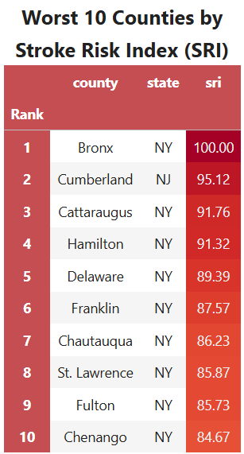
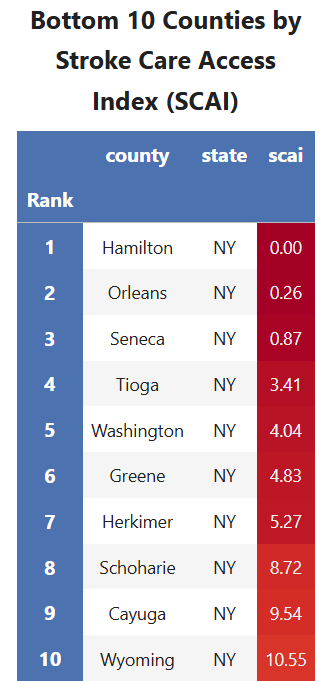
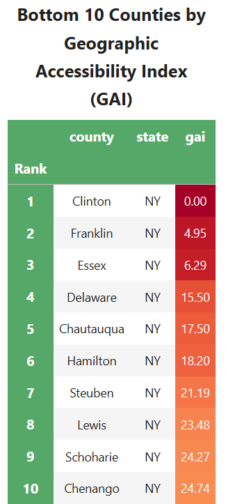

Combining stroke risk with access to care across 91 counties surfaces a clear
pattern: **12 counties are stroke care deserts** — high risk *and* poor access —
and every one of them is rural upstate New York, led by Hamilton County
(risk 91/100, access 0.04/100). Under the combined Stroke Burden Priority
Index, the highest-burden counties are Hamilton, Delaware, and Chenango.

The [interactive dashboard]({{ site.baseurl }}/dashboard/) shows the full
picture — including the Risk vs. Access matrix where these counties cluster in
the critical-intervention quadrant.

*Draft skeleton — this section will grow into the full analysis summary with
figures and plots (Discord 7/7). Drop finished .md content and images
(`docs/images/`) here.*

# Project Outcomes

## Overview

This project develops four indices to evaluate county-level stroke burden across New York, New Jersey, and Connecticut:

- **Stroke Risk Index (SRI):** Measures underlying population-level stroke risk using demographic, socioeconomic, behavioral, and clinical risk factors.
- **Stroke Care Access Index (SCAI):** Measures the availability of healthcare resources, including hospitals, physicians, hospital beds, and certified stroke centers.
- **Geographic Accessibility Index (GAI):** Measures physical access to stroke care based on travel time and distance to certified stroke centers.
- **Stroke Burden Priority Index (SBPI):** Integrates the three component indices into a single measure that identifies counties with the greatest overall need for stroke prevention and healthcare investment.

Together, these indices provide a comprehensive framework for identifying geographic disparities in stroke risk and healthcare access. The results can support public health planning, healthcare resource allocation, stroke system planning, and future research by highlighting communities where targeted interventions may have the greatest impact.

---

## Stroke Risk Index (SRI)

### What it Measures

The Stroke Risk Index (SRI) quantifies county-level stroke risk using demographic, socioeconomic, behavioral, and clinical risk factors. Variables include the proportion of older adults, poverty, educational attainment, health insurance coverage, smoking, binge drinking, obesity, diabetes, hypertension, high cholesterol, physical inactivity, and stroke prevalence. Higher SRI scores indicate a greater underlying population risk for stroke.

### Key Findings

The SRI identified substantial variation in stroke risk across the tri-state region. Counties with the highest scores generally exhibited a combination of adverse socioeconomic conditions and elevated prevalence of modifiable stroke risk factors. The index explained approximately **52.2%** of the total variability among the included variables, indicating that the first principal component captured a meaningful summary of county-level stroke risk.

### Counties with Highest and Lowest Scores

The highest SRI scores were observed in counties such as **Bronx (NY)**, **Hamilton (NY)**, **Delaware (NY)**, **Franklin (NY)**, and **St. Lawrence (NY)**, reflecting elevated stroke risk driven by demographic and health-related factors. In contrast, several suburban counties surrounding New York City and northern New Jersey had the lowest SRI scores, indicating comparatively lower population-level stroke risk.

### Distribution of Scores

The distribution of SRI scores was approximately symmetric following transformation and standardization, with scores spanning the full 0–100 scale. The histogram and boxplot demonstrate substantial variability between counties while showing relatively little skewness, indicating that the index effectively differentiates counties with low, moderate, and high stroke risk.

### Worst 10 Counties

    

<i>Figure 1. Ten counties with the highest Stroke Risk Index (SRI) scores.</i>

The Bronx ranks highest, followed by several rural counties in upstate New York including Hamilton, Delaware, Franklin, St. Lawrence, and Chenango. These results suggest that elevated stroke risk is present in both densely populated urban environments and geographically isolated rural communities.

---

## Stroke Care Access Index (SCAI)

### What it Measures

The Stroke Care Access Index (SCAI) measures the availability of healthcare resources that support stroke prevention and treatment within each county. The index incorporates hospitals, hospital beds, primary care physicians, neurologists, and certified stroke centers, providing an overall measure of healthcare capacity. Higher scores indicate greater access to healthcare resources, while lower scores indicate more limited healthcare infrastructure.

### General Patterns

The SCAI revealed substantial variation in healthcare resource availability across the tri-state region. Counties within major metropolitan areas generally had the highest scores due to larger hospital systems, greater physician density, and more certified stroke centers. In contrast, many rural counties in northern and western New York had considerably lower scores, reflecting limited healthcare infrastructure.

### Counties with Highest and Lowest Access

The highest SCAI scores were observed in urban counties with extensive healthcare networks, including New York County (Manhattan), Bronx County, Kings County (Brooklyn), and several counties in northern New Jersey. The lowest scores were concentrated in rural upstate New York, with Hamilton, Lewis, Delaware, and Franklin Counties consistently ranking among the counties with the poorest healthcare resource availability.

### Interpretation

The SCAI demonstrates that healthcare resources are not evenly distributed across the study region. Counties with stronger healthcare infrastructure generally also exhibited better geographic accessibility (*r* = 0.54), while counties with limited resources were more likely to have higher stroke risk (*r* = -0.33) and higher stroke mortality (*r* = -0.30). These findings suggest that healthcare resource availability is an important contributor to disparities in stroke care and should be considered alongside geographic accessibility when identifying underserved communities.

### Worst 10 Counties

    

<i>Figure 2. Ten counties with the lowest Stroke Care Access Index (SCAI) scores.</i>

The counties with the lowest scores are almost exclusively rural counties in New York, indicating limited healthcare infrastructure relative to the regional average. Hamilton County exhibits the poorest healthcare resource availability, with several neighboring counties showing similarly limited access.

---

## Geographic Accessibility Index (GAI)

### What it Measures

The Geographic Accessibility Index (GAI) measures how easily individuals can reach certified stroke centers based on travel time and distance. Higher scores indicate shorter travel times and better geographic access to stroke care, while lower scores indicate greater travel barriers.

### Geographic Patterns

The GAI reveals clear spatial disparities across the tri-state region. Counties surrounding major metropolitan areas—particularly New York City, northern New Jersey, and parts of Connecticut—generally have the highest accessibility. In contrast, many rural counties in northern and western New York have substantially lower GAI scores due to longer travel times to certified stroke centers.

### Urban vs. Rural Differences

Urban counties benefit from dense hospital networks and multiple nearby stroke centers, resulting in higher GAI scores. Rural counties often face longer travel distances and fewer treatment options, creating significant barriers to timely stroke care.

### Interpretation

The GAI demonstrates that geographic location is a critical component of healthcare accessibility. The index showed a moderate negative correlation with the Stroke Risk Index (*r* = -0.52) and acute stroke mortality (*r* = -0.35), suggesting that counties with higher stroke risk and mortality often have poorer geographic access to care. These findings highlight the importance of considering travel time alongside healthcare resources when identifying underserved communities.

### Worst 10 Counties

    

<i>Figure 3. Ten counties with the lowest Geographic Accessibility Index (GAI) scores.</i>

Counties such as Clinton, Franklin, Essex, Delaware, and Hamilton rank among the lowest due to their long travel times to advanced stroke care. These findings reinforce the geographic disparities observed in the accessibility maps and demonstrate that many rural counties face substantial barriers to timely emergency stroke treatment.

### Figures: 

<h2>Accessibility to Basic Stroke Centers</h2>

  

<i>Figure 4. County-level drive time to the nearest certified Basic Stroke Center. Counties are categorized into four travel-time intervals, illustrating regional differences in access to basic stroke care.</i>

Basic stroke centers are distributed throughout the region, resulting in relatively short travel times for most counties. The highest accessibility is concentrated around major metropolitan areas, while some rural counties in northern New York remain more than 60 minutes from the nearest facility. Overall, the map suggests that access to basic stroke care is relatively widespread, though notable geographic disparities remain in rural regions.

<h2>Accessibility to Advanced Stroke Centers</h2>

  

<i>Figure 5. County-level drive time to the nearest certified Advanced Stroke Center. Advanced stroke centers are concentrated in metropolitan regions, resulting in substantially longer travel times for many rural counties.</i>

Compared to basic stroke centers, advanced centers are substantially less common and are concentrated in densely populated metropolitan regions, particularly around New York City and portions of Connecticut. Large portions of northern and western New York fall into the 60+ minute travel category, indicating limited access to specialized stroke care. These differences highlight the importance of distinguishing between basic and advanced stroke services when evaluating geographic accessibility.

<h2>Stroke Center Distribution</h2>

  

<i>Figure 6. Locations of certified Basic Stroke Centers (circles) and Advanced Stroke Centers (triangles) overlaid on county accessibility categories.</i>

This map overlays both Basic Stroke Centers (circles) and Advanced Stroke Centers (triangles) on county accessibility categories. The figure demonstrates the geographic concentration of advanced stroke care around major urban centers while illustrating the broader distribution of basic stroke centers. Together, these patterns reveal substantial spatial disparities in access to specialized stroke treatment, particularly in rural counties.

---

## Summary of Three Original Indices

The table below summarizes the construction and performance of the three composite indices developed for this project.

| Index | Variables Included | PC1 Variance Explained | Interpretation |
|-------|---------------------|-----------------------:|----------------|
| **Stroke Risk Index (SRI)** | Population density, age 65+, poverty, low-income population, educational attainment, smoking, obesity, diabetes, hypertension, high cholesterol, physical inactivity, binge drinking, stroke prevalence | **52.2%** | Measures county-level stroke vulnerability based on demographic, socioeconomic, and health-related risk factors. Higher scores indicate greater stroke risk. |
| **Stroke Care Access Index (SCAI)** | Hospital beds per 100,000, primary care physicians per 100,000, neurologists per 100,000, uninsured population | **53.9%** | Measures the availability of healthcare resources related to stroke prevention and treatment. Higher scores indicate better access to stroke care. |
| **Geographic Accessibility Index (GAI)** | Drive time to the nearest stroke center, drive time to the nearest advanced stroke center, distance to the nearest stroke center, distance to the nearest advanced stroke center | **77.0%** | Measures the geographic accessibility of stroke care. Higher scores indicate better geographic access. |

---

## Stroke Burden Priority Index (SBPI)

### What it Measures

The Stroke Burden Priority Index (SBPI) integrates the Stroke Risk Index (SRI), Stroke Care Access Index (SCAI), and Geographic Accessibility Index (GAI) into a single composite measure. By combining population-level stroke risk with healthcare resource availability and geographic access to stroke care, the SBPI identifies counties where the overall burden of stroke is greatest and where interventions may have the greatest impact.

### Final County Rankings

The SBPI produced a comprehensive ranking of all counties across New York, New Jersey, and Connecticut. Counties with high stroke risk and limited healthcare access consistently received the highest SBPI scores, while counties with lower stroke risk and stronger healthcare infrastructure ranked lowest.

### Priority Counties

The highest-priority counties were concentrated in rural upstate New York. Hamilton, Delaware, Chenango, Essex, Seneca, and Franklin Counties consistently ranked among the highest, reflecting the combined effects of elevated stroke risk, limited healthcare resources, and reduced geographic accessibility. These counties emerged as the areas with the greatest overall need for targeted public health interventions.

<h2>Highest Priority Counties</h2>

  

<i>Figure 7. Twenty counties with the highest Stroke Burden Priority Index (SBPI), representing locations where elevated stroke risk coincides with reduced healthcare accessibility.</i>

The lollipop chart above ranks the twenty counties with the highest Stroke Burden Priority Index scores. Nearly all of the highest-priority counties are located in rural upstate New York, where elevated stroke risk coincides with reduced healthcare resources and longer travel times to stroke centers. Counties such as Hamilton, Delaware, Chenango, and Essex consistently emerge as the highest-priority locations for potential intervention. This ranking provides a practical framework for identifying counties where investments in stroke prevention, healthcare resources, or geographic accessibility may have the greatest impact.

---

## Complete Index Analysis

[View the Full Analysis Notebook](../notebooks/Analysis%20of%20Stroke%20Burden%20Indices.html)

<h2>Distribution of Indices</h2>

  

<i>Figure 8. Distribution of the Stroke Risk Index (SRI), Stroke Care Access Index (SCAI), Geographic Accessibility Index (GAI), and Stroke Burden Priority Index (SBPI).</i>

The histograms above summarize the distributions of the four indices across all counties. The SRI, GAI, and SBPI exhibit relatively symmetric distributions centered near the middle of the standardized 0–100 scale, indicating that counties span the full spectrum of stroke risk and accessibility. The SCAI distribution is more concentrated toward lower values, reflecting that relatively few counties possess abundant healthcare resources. Mean and median values are generally similar, suggesting limited skewness after transformation and standardization.

  

<i>Figure 9. Boxplots summarizing the distribution, variability, and outliers of each composite index.</i>

The boxplots above provide a concise summary of each index's central tendency and variability. The relatively wide interquartile ranges indicate meaningful differences between counties, supporting the usefulness of the indices for distinguishing geographic variation. SCAI contains a small number of high-scoring outliers, representing counties with substantially greater healthcare resource availability than the regional average. Overall, the indices exhibit sufficient variability to support meaningful comparisons across counties.

<h2>Relationships Between Indices</h2>

  

<i>Figure 10. Pearson correlation matrix illustrating relationships among the four indices.</i>

The correlation matrix demonstrates that the indices capture related but distinct dimensions of stroke burden. SRI is moderately negatively correlated with both SCAI and GAI, indicating that counties with higher stroke risk generally have poorer healthcare access. SCAI and GAI exhibit a moderate positive correlation, suggesting that counties with stronger healthcare infrastructure also tend to have shorter travel times to stroke care. As expected, SBPI is strongly positively correlated with SRI because stroke risk is the primary driver of overall priority while still incorporating accessibility measures.

  

<i>Figure 11. Pairwise relationships among the indices with fitted regression lines.</i>

The pairwise regression plots further illustrate the relationships among the indices. Negative associations between SRI and both accessibility indices reinforce the observation that higher-risk counties often experience reduced access to care. Conversely, SCAI and GAI display a positive relationship, indicating that counties with greater healthcare capacity also tend to have better geographic accessibility. The strong relationship between SBPI and SRI confirms that the composite priority index effectively incorporates stroke risk while still reflecting accessibility information.

<h2>Relationship With Stroke Mortality</h2>

  

<i>Figure 12. Relationships between each composite index and county-level acute stroke mortality.</i>

The scatterplots above compare each index with observed county-level acute stroke mortality. SRI demonstrates the strongest positive relationship with mortality, suggesting that higher estimated stroke risk corresponds with higher observed mortality rates. Both SCAI and GAI exhibit negative relationships with mortality, indicating that counties with better healthcare resources and shorter travel times generally experience lower mortality. SBPI also demonstrates a positive association with mortality, providing evidence that the integrated index successfully identifies counties with greater overall stroke burden.

<h2>Comparison by State</h2>

  

<i>Figure 13. Distribution of index scores across New York, New Jersey, and Connecticut.</i>

The violin plots above compare index distributions across New York, New Jersey, and Connecticut. New York exhibits the greatest variability across all indices, reflecting the coexistence of highly urbanized counties with excellent access and remote rural counties with substantial barriers to care. New Jersey generally demonstrates stronger healthcare access and lower variability due to its dense healthcare network, while Connecticut occupies an intermediate position. These state-level differences highlight how geography contributes to disparities in stroke risk and accessibility.

## Key Findings

- Geographic disparities in stroke care are substantial across the tri-state region. Urban counties generally have greater healthcare capacity and shorter travel times to certified stroke centers, while many rural counties in northern and western New York experience limited healthcare resources and reduced geographic accessibility.

- The indices exhibited meaningful relationships with one another. Counties with higher stroke risk generally had poorer healthcare access, while counties with stronger healthcare infrastructure also tended to have better geographic accessibility.

- The indices were associated with county-level acute stroke mortality, providing evidence that counties exhibiting high stroke risk, poor geographic access, and poor access to healthcare services, are associated with a higher stroke mortality rate.

- Several rural upstate New York counties, including Hamilton, Delaware, Chenango, Essex, Franklin, and Lewis, consistently ranked among the highest-priority counties across multiple indices, indicating overlapping challenges related to stroke risk, healthcare resources, and geographic access.

---

## Applications

The Stroke Risk Index (SRI), Stroke Care Access Index (SCAI), Geographic Accessibility Index (GAI), and Stroke Burden Priority Index (SBPI) provide a flexible framework for identifying disparities in stroke risk and access to care. Potential applications include:

### Public Health Planning

Public health agencies can use the indices to identify counties with elevated stroke burden and prioritize communities for prevention initiatives, health education campaigns, and community outreach programs. By highlighting areas where stroke risk is greatest, resources can be directed toward populations most likely to benefit from targeted interventions.

### Healthcare Resource Allocation

The SCAI and GAI can help identify counties with limited healthcare resources or poor geographic access to certified stroke centers. These findings can support decisions regarding the placement of additional healthcare providers, telemedicine services, emergency medical resources, or investments in rural healthcare infrastructure.

### Stroke System Planning

Healthcare systems and emergency planners can use the accessibility analyses to evaluate regional coverage of certified stroke centers and identify underserved areas. The geographic accessibility maps may help inform decisions about where new stroke centers, transfer agreements, or emergency transport strategies could improve timely access to care.

### Policy Evaluation

The indices provide a quantitative framework for monitoring changes in stroke care over time. As healthcare resources expand or new stroke centers are established, the indices can be recalculated to evaluate whether accessibility and healthcare equity have improved and to measure the effectiveness of policy interventions.

### Research

The composite indices can serve as predictors or explanatory variables in future studies examining stroke incidence, mortality, healthcare utilization, or health disparities. Because the methodology is data-driven and reproducible, it can be adapted to other geographic regions or extended by incorporating additional demographic, environmental, or socioeconomic variables.

### Decision Support

The integrated Stroke Burden Priority Index (SBPI) provides a single, interpretable measure that summarizes stroke risk, healthcare resource availability, and geographic accessibility. Decision-makers can use the SBPI to rank counties according to overall need, helping prioritize investments where they are likely to have the greatest public health impact.

---

## Future Work

While this project provides a comprehensive framework for evaluating county-level stroke burden, several opportunities exist to expand and improve the methodology.

- **Expand the geographic scope:** Apply the framework to additional states or the entire United States to enable nationwide comparisons and identify regional disparities in stroke burden.

- **Incorporate EMS response times:** Include emergency medical service (EMS) response and transport times to better capture the complete timeline from stroke onset to treatment, providing a more comprehensive measure of accessibility.

- **Analyze temporal trends:** Recalculate the indices using data from multiple years to evaluate how stroke risk, healthcare resources, and accessibility change over time and to assess the impact of policy or infrastructure improvements.

- **Develop an automated annual update pipeline:** Automate data collection and index generation so the SRI, SCAI, GAI, and SBPI can be updated annually as new public health and healthcare datasets become available.

